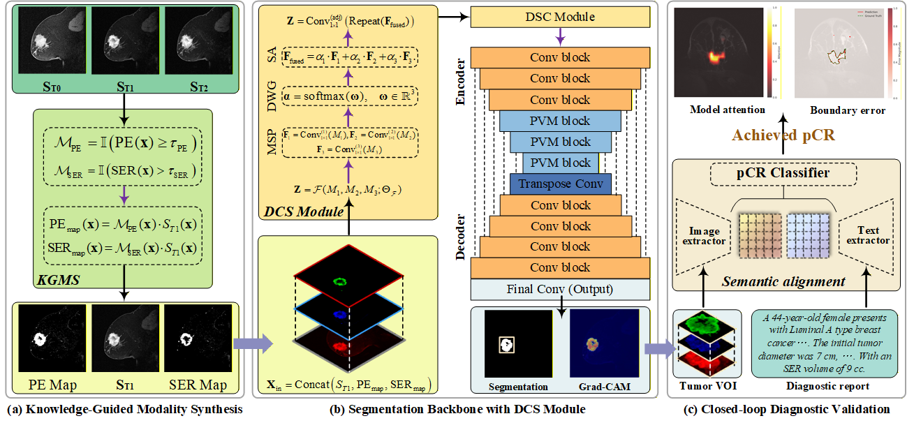

# KFI-Net: Integrating Pharmacokinetic Knowledge as First-Class Inputs for Breast Tumor Segmentation in DCE-MRI

This repository contains the complete implementation for the paper "KFI-Net: Integrating Pharmacokinetic Knowledge as First-Class Inputs for Breast Tumor Segmentation in DCE-MRI", submitted to TMI 2026.

## Project Overview
KFI-Net introduces a novel paradigm shift from learning kinetics from data to seeing kinetics through knowledge in breast Dynamic Contrast-Enhanced MRI (DCE-MRI) analysis. Unlike conventional deep learning approaches that discard temporal context or reduce it to uninterpretable feature stacks, KDF-Net architecturally elevates pharmacokinetic principles to the status of first-class inputs, providing intrinsically interpretable predictions aligned with clinical reasoning.

## Methodology
The framework achieves trustworthy AI in medical imaging through three key innovations:

- Knowledge-Guided Modality Synthesis (KGMS) Module: Converts pharmacokinetic models into learnable image modalities (PE and SER maps)

- Dynamic Cross-modal Synergy (DCS) Module: Performs voxel-wise, adaptive fusion of knowledge with anatomical features

- Closed-loop Validation: Links tumor segmentation directly to pathological complete response (pCR) prediction

## Execution Pipeline
Step 1: Data Processing (Data processing/)
- Dataset Analysis: Comprehensive analysis of the MAMA-MIA dataset (1,506 patients from DUKE, NACT, ISPY1, and ISPY2 cohorts)
- Knowledge-Guided Modality Synthesis: Generation of pharmacokinetic features (FTV_PE, FTV_SER) as explicit knowledge inputs
- Output: Structured knowledge modalities ready for fusion with anatomical data

Step 2: Model Implementation (Segmentation framework/)
- KDF-Net Architecture: Complete implementation of the knowledge-aware dynamic fusion model
- Backbone Networks: Feature extraction components for anatomical information
- Dynamic Cross-modal Synergy Module: Lightweight fusion mechanism for adaptive knowledge integration

Step 3: Clinical Evaluation (Clinical_evaluation/)
- Tumor VOI Generation: Extraction of Volumes of Interest for clinical validation studies
- Clinical Report Generation: Automated generation of structured diagnostic reports
- Training Framework: Full 5-fold cross-validation with closed-loop pCR prediction
- Interpretability Analysis: Tools for visualizing attention maps aligned with clinical reasoning

## Key Features
- Interpretable by Design: Produces attention maps directly aligned with pharmacokinetic principles
- Knowledge-Aware Fusion: Dynamically combines anatomical and pharmacokinetic information
- Clinical Validation: Closed-loop integration from segmentation to treatment response prediction
- State-of-the-Art Performance: Demonstrated superior performance in tumor segmentation and pCR prediction

## Requirements
Key dependencies for running KDF-Net:
- PyTorch (>=2.0.1) - Core deep learning framework
- torchvision - Vision utilities
- SimpleITK (>=2.3.1) & NiBabel (>=5.2.1) - Medical image processing
- numpy & scipy - Scientific computing
- pandas - Data manipulation and analysis
- scikit-learn & scikit-image - Machine learning and image processing
- matplotlib & seaborn - Visualization and plotting
- tqdm - Progress bars
- PyYAML - Configuration file handling

For the complete list with exact versions, see requirements.txt.

## License
This code is released for academic research purposes only.
